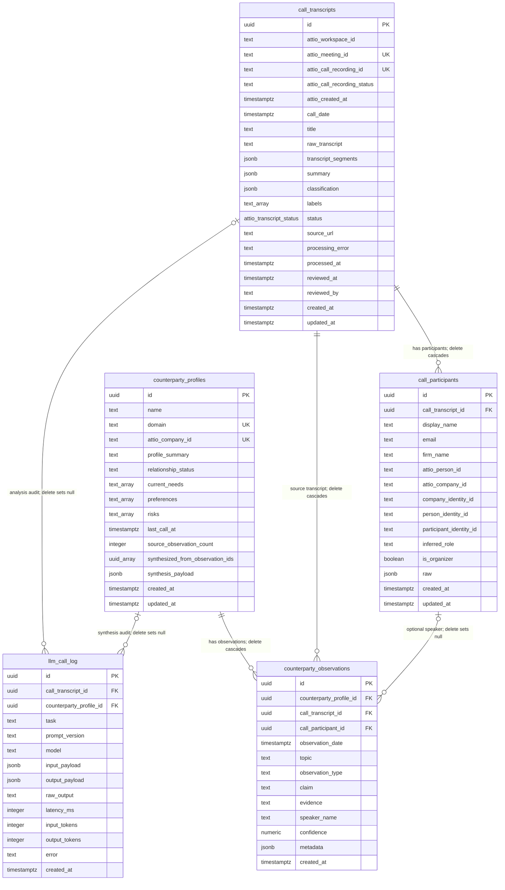
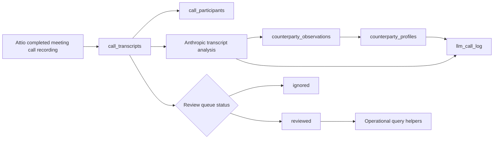

# Attio Transcript Supabase ERD

This diagram covers the neutral data-layer tables used by the Attio transcript ingestion module.

## Review Gate

Operational helpers should only expose observations joined to transcripts where `call_transcripts.status = 'reviewed'`.

## Constraints And Indexes

- `call_transcripts`: unique `(attio_meeting_id, attio_call_recording_id)`, indexed by `status + call_date`, `call_date`, and `labels`.
- `call_participants`: unique participant per transcript by Attio person id or lowercase email.
- `counterparty_profiles`: unique by `attio_company_id` when present, otherwise unique by `domain` when present.
- `counterparty_observations`: unique `(call_transcript_id, topic, claim, speaker_name)`.
- `llm_call_log`: indexed by transcript, profile, and task for audit lookups.
